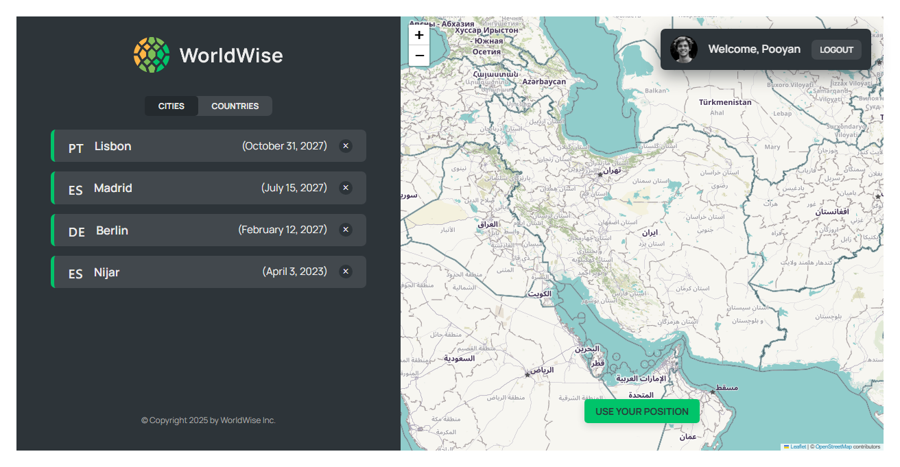
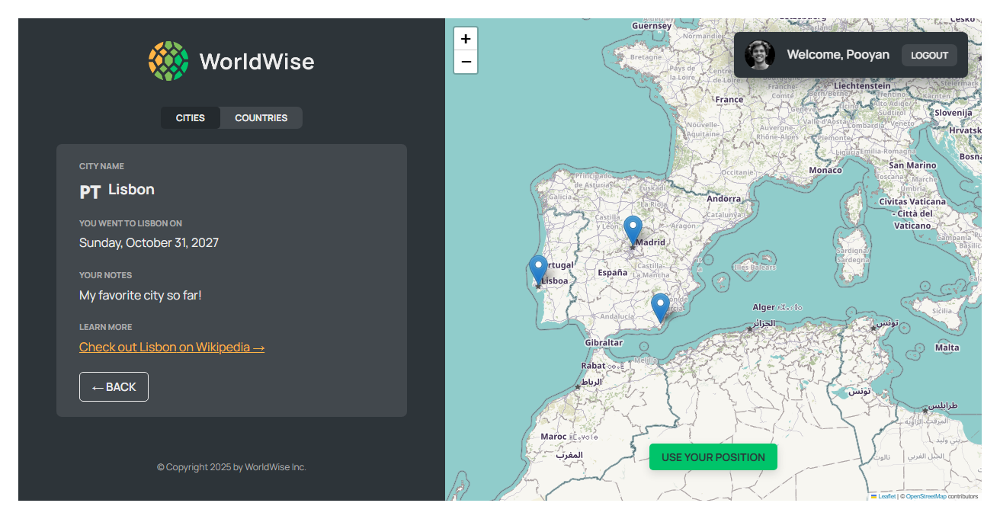

# Word-Wize 🚀

Word-Wize is a modern and responsive web application for **learning and reviewing vocabulary**. Users can add new words, organize them into categories, and track their progress.

---

## 📑 Table of Contents

- [Features](#-features)
- [Requirements](#-requirements)
- [Installation](#-installation)
- [Project Structure](#-project-structure)
- [Screenshots](#-screenshots)
- [Demo Credentials](#-demo-credentials)
- [Contributing](#-contributing)

---

## 🎯 Features

-**Mark Visited Locations**: Users can mark the places they have visited directly on the interactive map.

-**Location & City List**: Marked locations are automatically saved in a list of cities along with their names.

-**Add Descriptions**: Users can add custom notes or descriptions for each marked location.

-**Visited Countries Tracker**: A separate list keeps track of countries visited, which updates automatically when cities are marked on the map.

-**Interactive Map Integration**: All locations and countries are synchronized visually on the map for easy reference.

---

## ⚡ Requirements

- Node.js v14 or higher
- NPM or Yarn for package management

---

## 🛠 Installation

1. **Clone the repository:**

```bash
git clone https://github.com/Pooyan06/Word-Wize.git
```

2. **Install dependencies:**

```bash
cd Word-Wize
npm install
```

3. **Run the development server:**

```bash
npm run dev
npm run server
```

---

## 🗂 Project Structure

```
Word-Wize/
│
├─ src/           # Source code
├─ public/        # Public files like images and fonts
├─ data/          # Initial data or JSON files
├─ .eslintrc.json # ESLint configuration
├─ package.json   # Package management and scripts
└─ vite.config.js # Vite configuration
```

---

## 📸 Screenshots

You can place screenshots of the application here:





---

## 📝 Demo Credentials

To test the application, use the following demo account:

- **Email:** pooyan@email.com
- **Password:** qwerty

---

## 🤝 Contributing

We welcome contributions! If you want to add features or fix bugs, please submit a Pull Request.

---

## 🧑‍💼 Author

**Pooyan Farhadi**
📧 [Contact](https://t.me/pooyan_f)
🌐 [GitHub Profile](https://github.com/Pooyan06)

---

### ⭐ If you like this project, don’t forget to give it a star on GitHub!
